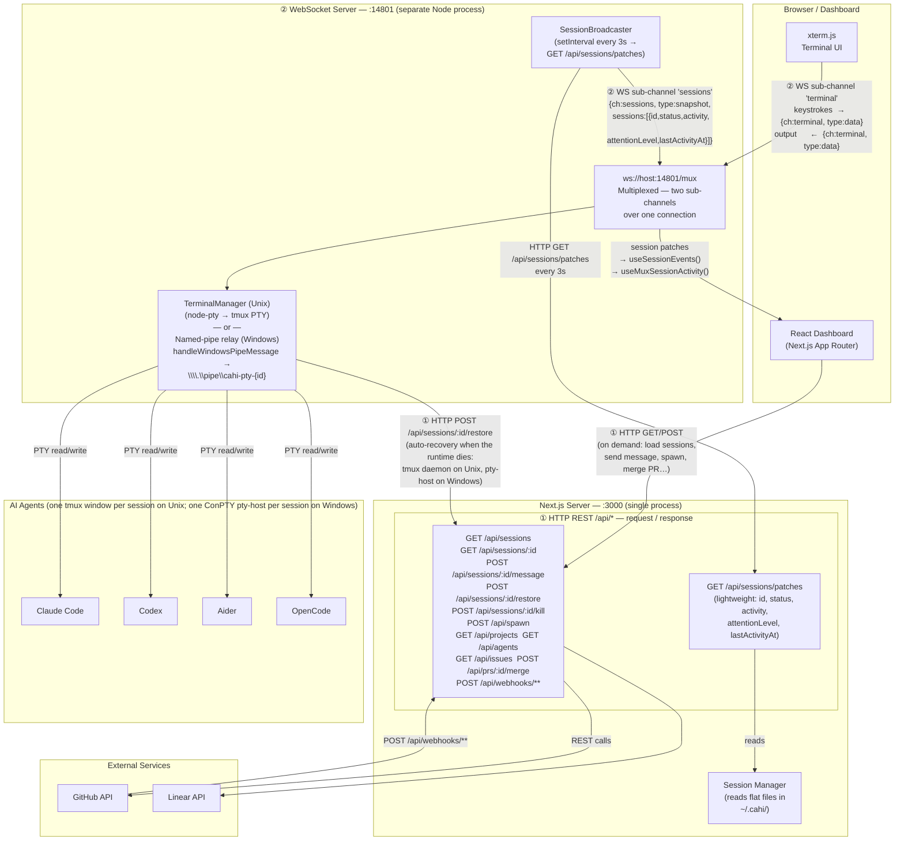
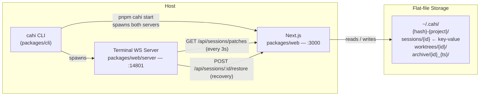
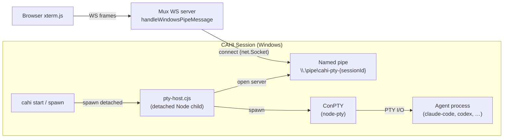
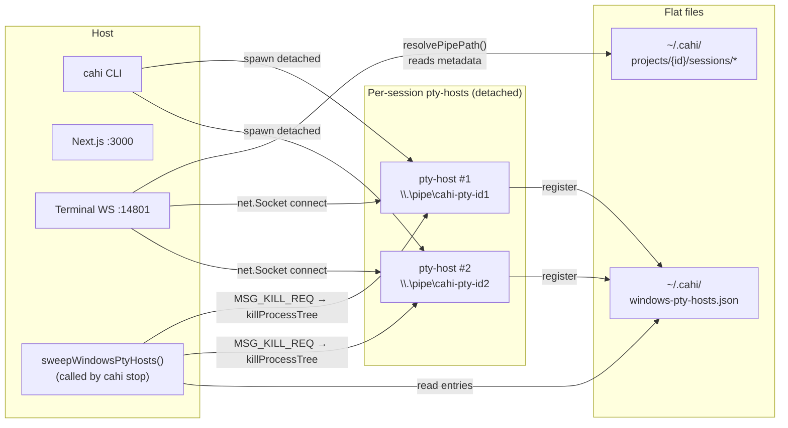

# CAHI — Technical Architecture

This document explains how the various parts of the CAHI communicate with each other: where HTTP is used, where WebSocket is used, and what each carries.

---

## System Overview



---

## Communication Channels

### 1. HTTP / REST — `/api/*` on port 3000

Used for all request-response interactions. The browser calls these on demand; the CLI and the WebSocket server also use them.

| Endpoint | Method | Purpose |
|----------|--------|---------|
| `/api/sessions` | GET | List all sessions (with PR / issue metadata) |
| `/api/sessions/light` | GET | Lightweight session list (minimal fields) |
| `/api/sessions/patches` | GET | Ultra-light patches (id, status, activity, attentionLevel) — polled by the WS server every 3s |
| `/api/sessions/:id` | GET | Full session detail |
| `/api/sessions/:id/message` | POST | Send a message/command to a live agent |
| `/api/sessions/:id/restore` | POST | Respawn a terminated session |
| `/api/sessions/:id/kill` | POST | Terminate a running session |
| `/api/sessions/:id/files` | GET | Browse workspace files |
| `/api/sessions/:id/diff/**` | GET | File diff view |
| `/api/sessions/:id/sub-sessions` | GET / POST | List / create sub-sessions (forked agents) |
| `/api/spawn` | POST | Spawn a new agent session |
| `/api/projects` | GET | List configured projects |
| `/api/agents` | GET | List registered agent plugins |
| `/api/issues` | GET | Fetch backlog issues |
| `/api/backlog` | GET | Backlog summary |
| `/api/prs/:id/merge` | POST | Merge a PR |
| `/api/observability` | GET | Health and metrics summary |
| `/api/verify` | POST | Verify environment setup |
| `/api/setup-labels` | POST | Set up GitHub labels |
| `/api/webhooks/**` | POST | Inbound webhooks from GitHub / GitLab |

---

### 2. WebSocket (Multiplexed) — `ws://localhost:14801/mux`

A **bidirectional multiplexed channel** on a separate Node.js process. A single WebSocket connection carries two independent sub-channels:

- **`terminal` channel** — raw PTY I/O for xterm.js
- **`sessions` channel** — real-time session status patches (fed by `SessionBroadcaster` polling `/api/sessions/patches` every 3s)

```mermaid
sequenceDiagram
    participant XTerm as xterm.js
    participant MuxClient as MuxProvider (browser)
    participant MuxWS as WS Server :14801/mux
    participant PTY as PTY (Unix: node-pty → tmux; Windows: named pipe → ConPTY pty-host)
    participant Next as Next.js :3000

    MuxClient->>MuxWS: connect ws://localhost:14801/mux

    Note over MuxClient,MuxWS: Open a terminal
    MuxClient->>MuxWS: {ch:"terminal", id:"sess-1", type:"open"}
    MuxWS->>PTY: attach (Unix: tmux PTY; Windows: connect named pipe)
    MuxWS-->>MuxClient: {ch:"terminal", id:"sess-1", type:"opened"}

    Note over MuxClient,MuxWS: Terminal I/O
    XTerm->>MuxClient: user keystrokes
    MuxClient->>MuxWS: {ch:"terminal", id:"sess-1", type:"data", data:"ls\r"}
    MuxWS->>PTY: write to PTY
    PTY-->>MuxWS: output bytes
    MuxWS-->>MuxClient: {ch:"terminal", id:"sess-1", type:"data", data:"file1 file2\r\n"}
    MuxClient-->>XTerm: render output

    Note over MuxWS,Next: Session patches (every 3s)
    MuxWS->>Next: GET /api/sessions/patches
    Next-->>MuxWS: [{id, status, activity, attentionLevel, lastActivityAt}]
    MuxWS-->>MuxClient: {ch:"sessions", type:"snapshot", sessions:[...]}
    MuxClient-->>MuxClient: useSessionEvents() + useMuxSessionActivity() update React state

    Note over MuxWS,Next: Auto-recovery (session dead)
    MuxWS->>Next: POST /api/sessions/sess-1/restore
    Next-->>MuxWS: 200 OK
    MuxWS->>PTY: reattach (Unix: new tmux session; Windows: reopen named pipe)
```

**Message types:**

| Direction | Channel | Type | Payload |
|-----------|---------|------|---------|
| Client→Server | `terminal` | `open` | `{ id }` |
| Client→Server | `terminal` | `data` | `{ id, data: string }` |
| Client→Server | `terminal` | `resize` | `{ id, cols, rows }` |
| Client→Server | `terminal` | `close` | `{ id }` |
| Client→Server | `subscribe` | — | `{ topics: ["sessions"] }` |
| Client→Server | `system` | `ping` | — |
| Server→Client | `terminal` | `opened` | `{ id }` |
| Server→Client | `terminal` | `data` | `{ id, data: string }` |
| Server→Client | `terminal` | `exited` | `{ id, code }` |
| Server→Client | `terminal` | `error` | `{ id, message }` |
| Server→Client | `sessions` | `snapshot` | `{ sessions: SessionPatch[] }` |
| Server→Client | `system` | `pong` | — |

---

## Process Map



The CLI (`cahi start`) forks two long-running processes:
- **Next.js** on `:3000` — serves the dashboard and all REST routes
- **Terminal WS server** on `:14801` — handles multiplexed WebSocket + PTY management + session patch polling. PTY transport is platform-specific: tmux via `node-pty` on Unix, named-pipe relay (`handleWindowsPipeMessage` → `\\.\pipe\cahi-pty-{sessionId}`) on Windows. Both paths use the same outer mux protocol.

Both processes share no in-memory state; coordination happens through flat files in `~/.cahi/` and HTTP calls from the WS server to Next.js.

---

## Data Flow Summary

| Scenario | Protocol | Path |
|----------|----------|------|
| Load dashboard | HTTP GET | Browser → `:3000/` (SSR page) |
| List sessions | HTTP GET | Browser → `:3000/api/sessions` |
| Spawn new agent | HTTP POST | Browser → `:3000/api/spawn` |
| Send message to agent | HTTP POST | Browser → `:3000/api/sessions/:id/message` |
| Real-time session status | WebSocket | Browser ← `:14801/mux` `sessions` sub-channel (pushed every 3s) |
| Terminal output / input | WebSocket | Browser ↔ `:14801/mux` `terminal` sub-channel (bidirectional) |
| WS server fetches patches | HTTP GET | `:14801` → `:3000/api/sessions/patches` (every 3s) |
| WS server restores session | HTTP POST | `:14801` → `:3000/api/sessions/:id/restore` |
| GitHub notifies of CI / PR | HTTP POST | GitHub → `:3000/api/webhooks/github` |
| CLI queries sessions | HTTP GET | `cahi` CLI → `:3000/api/sessions` |

---

## Windows Runtime Architecture

On Windows the high-level component map (HTTP API, mux WS server, dashboard, flat-file storage) is identical, but the **PTY transport layer is different** because tmux is not available natively. This section describes only what's different.

> For the developer-facing rules of "how do I write code that works on both," see [`docs/CROSS_PLATFORM.md`](CROSS_PLATFORM.md). The section below is the architectural reference for *what was built*.

### Default runtime

`getDefaultRuntime()` from `@contaazul/cahi-core` returns `"process"` on Windows and `"tmux"` everywhere else. A fresh Windows install therefore loads the `runtime-process` plugin without requiring YAML edits. Users on Unix who want the process runtime opt in via `runtime: process` in `cahi.yaml`.

### The pty-host helper process

Because `node-pty` ConPTY sessions are tied to the lifetime of the host Node process, the orchestrator can't simply spawn ConPTY directly inside Next.js or the mux WS server: those processes restart, get killed by `taskkill /T`, etc. Instead, each CAHI session on Windows owns a small dedicated helper process — the **pty-host**.



Implemented in `packages/plugins/runtime-process/src/pty-host.ts` (also runnable as a `.cjs` script). Key properties:

- Spawned `detached: true, windowsHide: true` by `runtime-process` and `unref`'d so it survives parent exit (mirrors tmux daemon behaviour).
- Signals readiness by printing `READY:<pid>` to stdout; the spawner waits for that line (10 s timeout) before considering the session up.
- Maintains a 1000-line rolling output buffer, ANSI-faithful, replayed to every new client connection (this is the "scrollback on attach" equivalent of `tmux attach`).
- Intercepts `SIGTERM`/`SIGINT`/`SIGHUP`/`SIGBREAK`/`beforeExit`/`uncaughtException`/`exit` and always calls `pty.kill()` before exiting. Without this, ConPTY's `conpty_console_list_agent.exe` orphans and triggers a Windows Error Reporting dialog (`0x800700e8`).

### Pipe protocol

The pty-host exposes a small binary protocol over `\\.\pipe\cahi-pty-{sessionId}`. Messages share a 5-byte header — `[1-byte type][4-byte big-endian length]` — followed by the payload.

| Type | Direction | Meaning |
|------|-----------|---------|
| `0x01` `MSG_TERMINAL_DATA` | host → client | Raw PTY output bytes |
| `0x02` `MSG_TERMINAL_INPUT` | client → host | User keystrokes (chunked into ≤512 chars with 15 ms gaps to avoid ConPTY input-buffer truncation) |
| `0x03` `MSG_RESIZE` | client → host | JSON `{cols, rows}` |
| `0x04` / `0x05` `MSG_GET_OUTPUT_REQ` / `_RES` | client ↔ host | Request and return scrollback buffer |
| `0x06` / `0x07` `MSG_STATUS_REQ` / `_RES` | client ↔ host | Liveness check (`{alive, pid, exitCode?}`) |
| `0x08` `MSG_KILL_REQ` | client → host | Cooperative shutdown (host disposes ConPTY then exits) |

Client helpers in `packages/plugins/runtime-process/src/pty-client.ts`:
- `connectPtyHost`, `ptyHostSendMessage`, `ptyHostGetOutput`, `ptyHostIsAlive`, `ptyHostKill`, plus `getPipePath(sessionId)` → `\\.\pipe\cahi-pty-{sessionId}`.
- `MessageParser` skips interleaved data frames so request/response pairs work over a busy pipe.

### Mux WS server: tmux vs Windows pipe relay

`packages/web/server/mux-websocket.ts` branches by platform:

- **Unix**: instantiates `TerminalManager` (node-pty → tmux PTY) and dispatches all `terminal` channel messages to it.
- **Windows**: skips `TerminalManager` entirely and routes through `handleWindowsPipeMessage(msg, ws, winPipes, winPipeBuffers, deps)`, which maps each `(projectId, sessionId)` to a `net.Socket` connected to its pipe. `open` opens the socket, `data` writes a `0x02` framed message, `resize` writes `0x03`, `close` ends the socket. Inbound `0x01` frames are forwarded back as WebSocket `{ch:"terminal", type:"data"}` payloads; `0x07` with `alive:false` becomes `exited`.
- The pipe path is resolved by `resolvePipePath(sessionId, projectId?)` in `packages/web/server/tmux-utils.ts`, which reads the session's metadata file (V2 layout `~/.cahi/projects/{projectId}/sessions/{sessionId}.json`, V1 fallback) and returns the `pipePath` field that `runtime-process` wrote at spawn time.
- `findTmux()` returns `null` on Windows; `direct-terminal-ws.ts` logs `Windows mode — using named pipe relay to PTY hosts` and starts the same WS server with no tmux dependency.

### Pty-host registry — `~/.cahi/windows-pty-hosts.json`

Because pty-hosts run detached, `taskkill /T` on the parent cahi-start process cannot reach them. To allow `cahi stop` to find and clean them up, every spawned pty-host is recorded in a small JSON registry.

`packages/core/src/windows-pty-registry.ts`:
- `registerWindowsPtyHost(entry)` — write/replace the entry on spawn.
- `getWindowsPtyHosts()` — read all entries; auto-prune any whose PID is gone (probed via `process.kill(pid, 0)`, treating `EPERM` as alive).
- `unregisterWindowsPtyHost(sessionId)` — remove on session destroy.
- `clearWindowsPtyHostRegistry()` — wipe (for tests / recovery).

`sweepWindowsPtyHosts()` (in `runtime-process`) iterates the registry: for each live entry it sends a graceful `MSG_KILL_REQ` over the pipe, polls up to 500 ms for the process to exit (treating `EPERM` as still alive), then `killProcessTree(ptyHostPid, "SIGKILL")` for stragglers. It is called by `cahi stop` and `cahi stop --all` before tearing down the parent process.

### Process map (Windows variant)



### Shell resolution

`getShell()` in `packages/core/src/platform.ts` is platform-aware and cached:

- **Unix**: `/bin/sh -c` (always; never `$SHELL` — non-interactive launches must not depend on the user's login shell).
- **Windows** (`resolveWindowsShell`): in priority order — `CAHI_SHELL` env override → `pwsh` on PATH → `%SystemRoot%\System32\WindowsPowerShell\v1.0\powershell.exe` (absolute path, robust to degraded PATH) → `powershell` on PATH → `%ComSpec%` (`cmd.exe`, last resort).

Args are inferred from the basename: `cmd` → `/c`, `bash`/`sh`/`zsh` → `-c`, anything PowerShell-shaped → `-Command`. `CAHI_SHELL` is the supported escape hatch (e.g. for Git Bash users).

### Other Windows-specific touch points

- **CLI** — `cahi start` no longer detaches its dashboard child on Windows (so Ctrl+C reaches the whole console group); `forwardSignalsToChild` is Unix-only. `cahi stop` calls `sweepWindowsPtyHosts()` before terminating the parent. `script-runner.ts` runs `.ps1` siblings of `.sh` scripts directly on Windows; otherwise it tries `CAHI_BASH_PATH` then auto-detects Git Bash (WSL bash is excluded — it sees Linux paths from a Windows cwd).
- **Agent plugins** — `setupPathWrapperWorkspace()` generates `.cjs` + `.cmd` wrapper pairs (instead of bash scripts) for `gh`/`git` interception. `formatLaunchCommand` for codex / kimicode prepends `& ` so PowerShell parses the quoted binary path as a call expression. `agent-claude-code` ships a Node.js metadata-updater (`.cjs`) hook in place of the bash version; system-prompt files are inlined rather than `$(cat …)`-substituted.
- **Path-equality** — `packages/cli/src/lib/path-equality.ts` (`pathsEqual`, `canonicalCompareKey`) handles NTFS case-insensitivity and drive-letter case differences when comparing project paths in `cahi start`.
- **`stopStaleWindowsPtyHosts(projectDir)`** in `packages/web/src/lib/windows-pty-cleanup.ts` is a defensive sweeper used by the dashboard to clean up orphan pty-hosts found via a PowerShell `Get-CimInstance Win32_Process` query.
